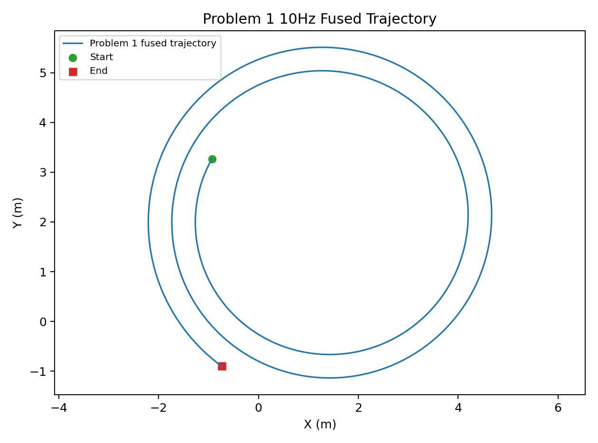
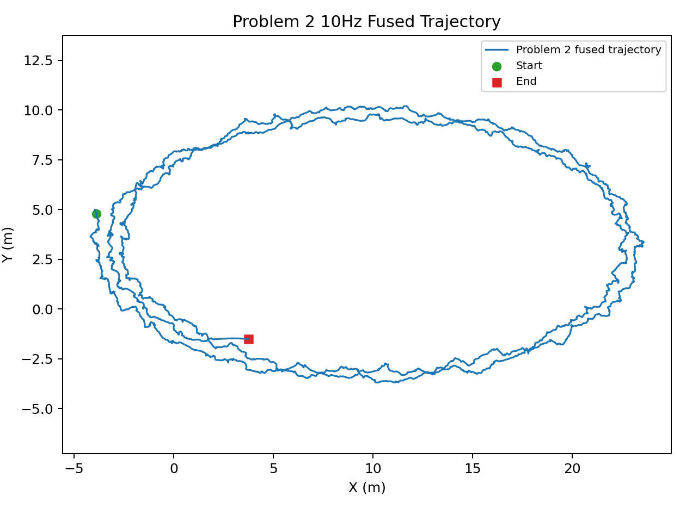
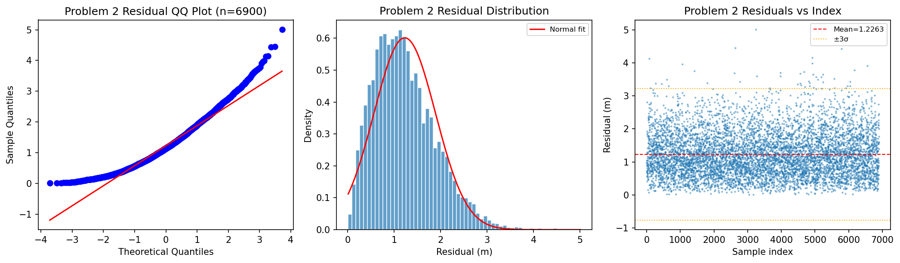
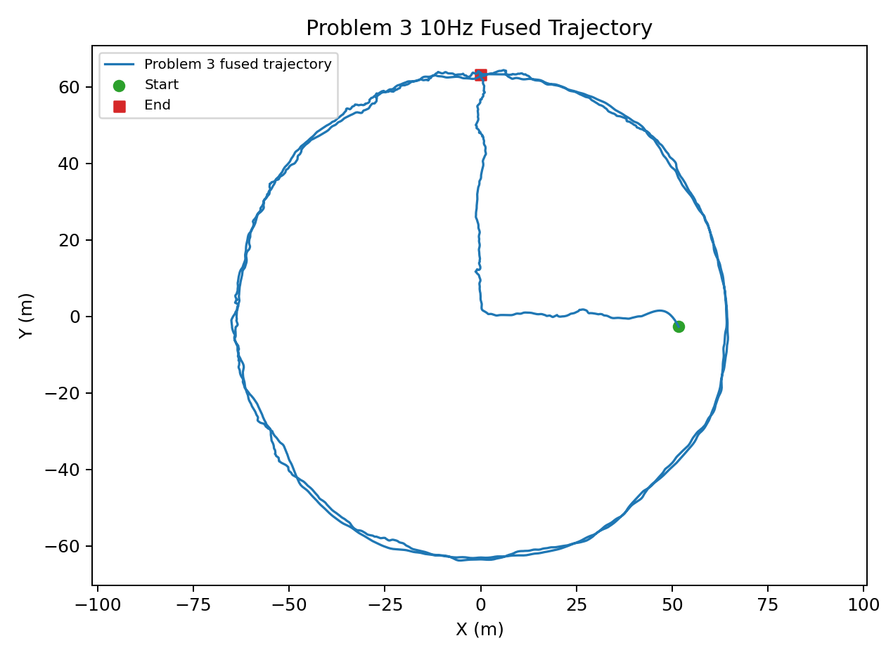
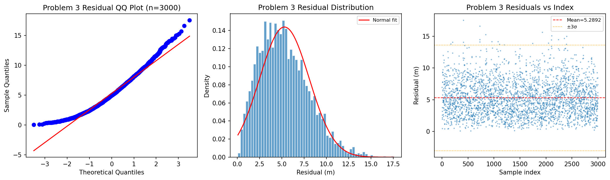
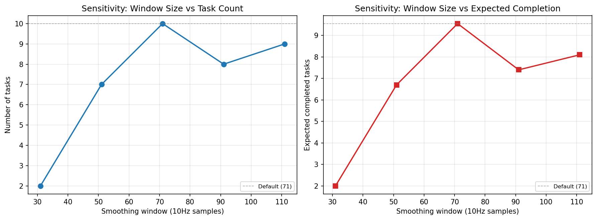
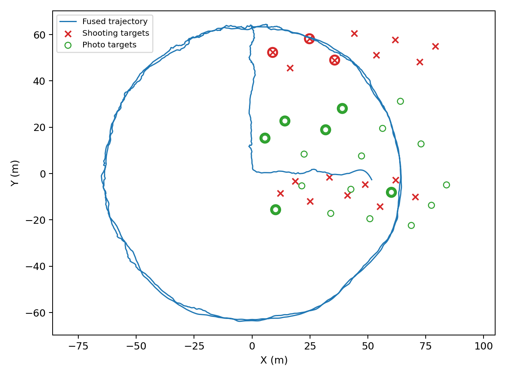
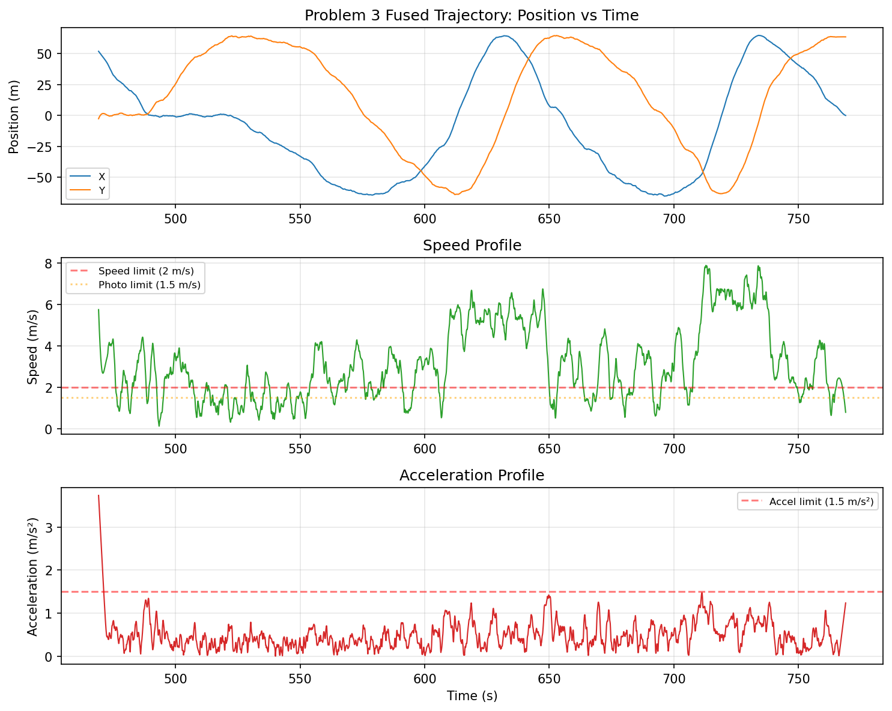

# 多源融合机器人定位及任务优化

## 摘要

针对两类异频异步定位数据（4Hz和5Hz），本文建立了以方式1为时间基准的轨迹对齐、固定偏差估计和10Hz重采样融合模型，并基于融合轨迹完成了射击与拍照任务的最优调度。

**问题1**在无噪声条件下，通过粗粒度网格搜索（2500点）结合Brent精细优化，得到方式2相对方式1的时间偏差为198.4317s，融合残差趋近于0，验证了模型在理想条件下的准确性。

**问题2**在随机噪声和系统偏差共同存在时，采用带偏差校正的对齐模型，估计方式2时间偏差为50.5465s（95%置信区间[50.5423,50.5492]s），方式2相对方式1的系统偏差为(3.4884,-1.8223)m。嵌套模型F检验结果表明，引入偏差参数后匹配均方误差下降98.25%（F=193895.53, p≈0），系统偏差高度显著。

**问题3**基于实测数据的分析中，F检验显示存在统计显著的固定系统偏差（F=22.92, p=0.0000），偏差量为(-0.1608,-0.1969)m，偏差范数0.254m。由于同时满足统计显著性和实际显著性（范数≥0.1m），采用带偏差模型输出10Hz融合轨迹。

**问题4**基于问题3的融合轨迹，考虑距离、速度、加速度、准备时间和拍照角度等约束，采用加权区间调度（动态规划）最大化期望完成数，共得到10项非重叠任务（射击3项、拍照7项），考虑85%射击命中率后的期望完成数为9.55。敏感性分析表明平滑窗口选择对任务数量有直接影响，窗口71（10Hz点数）时调度结果最优。

**关键词：** 多源融合；时间对齐；系统偏差；F检验；Savitzky-Golay平滑；加权区间调度；10Hz重采样；Bootstrap置信区间

## Abstract

This paper addresses the fusion of two heterogeneous asynchronous positioning data streams (4Hz and 5Hz). Using Mode 1 as the temporal reference, we develop a comprehensive framework for trajectory alignment, systematic bias estimation, and 10Hz resampling fusion, followed by optimal task scheduling based on the fused trajectory.

**Problem 1:** Under noise-free conditions, a coarse-to-fine optimization strategy (2,500-point grid search plus Brent refinement) estimates the time offset of Mode 2 relative to Mode 1 as 198.4317s, with near-zero fusion residuals, validating the alignment model under ideal conditions.

**Problem 2:** With combined random noise and systematic bias, the bias-corrected alignment model estimates the time offset as 50.5465s (95% CI: [50.5423, 50.5492]s) and the systematic bias as (3.4884, -1.8223)m. An F-test for nested model comparison confirms the bias parameters are highly significant (F = 193,895.53, p ≈ 0), reducing the matching MSE by 98.25%.

**Problem 3:** Analysis of real-world data reveals a statistically significant systematic bias (F = 22.92, p = 0.0000) of (-0.1608, -0.1969)m with a norm of 0.254m. Given both statistical and practical significance (norm ≥ 0.1m), the bias model is adopted for 10Hz trajectory fusion.

**Problem 4:** Using the fused trajectory from Problem 3 and considering constraints on distance, speed, acceleration, preparation time, and photography angles, weighted interval scheduling (dynamic programming) maximizes the expected number of completed tasks. The optimal schedule yields 10 non-overlapping tasks (3 shooting, 7 photography) with an expected completion count of 9.55 (accounting for 85% shooting accuracy). Sensitivity analysis confirms that the smoothing window size directly impacts task count, with window 71 (in 10Hz samples) producing the optimal schedule.

**Keywords:** Multi-source fusion; Time alignment; Systematic bias; F-test; Savitzky-Golay smoothing; Weighted interval scheduling; 10Hz resampling; Bootstrap confidence interval

---

## 第1章 问题重述

### 1.1 问题背景

在现代机器人定位与导航系统中，多源传感器融合是一项关键技术。不同定位系统往往具有不同的采样频率、时间基准和误差特性，如何有效地将异频异步的定位数据融合为高精度、高频率的连续轨迹，是自主导航领域的基础性问题。

本题涉及两种定位方式：方式1以4Hz频率采集位置数据，方式2以5Hz频率采集位置数据。两种方式存在起始时间不同步、采样频率不一致、随机测量噪声以及可能的固定系统偏差等问题。题目要求建立数学模型，实现两种定位数据的时间对齐、偏差修正和轨迹融合，并基于融合轨迹完成射击与拍照任务的设计与优化。

### 1.2 问题1：无噪声条件下的时间偏差估计

**问题描述：** 附件1给出了两种定位方式在无噪声条件下的位置采样数据。方式1采样点数3000个（4Hz），方式2采样点数4001个（5Hz），总时长约800s。由于两种方式的起始时间不同步，需要估计方式2相对方式1的时间偏差delta。

**已知条件：**
- 方式1采样频率4Hz，时间间隔0.25s
- 方式2采样频率5Hz，时间间隔0.20s
- 数据不含随机噪声和系统偏差
- 待估参数：方式2相对方式1的时间偏差delta

**目标：** 精确估计时间偏差delta，使两种方式在相同时间基准下的轨迹达到最优匹配，并输出融合后的10Hz轨迹。

#### 1.2.1 方式1数据特征

方式1以4Hz频率采样，采样间隔Δt₁=0.25s，共3000个数据点。数据记录格式为（时间, X坐标, Y坐标），时间基准从0s开始至约750s结束。在无噪声条件下（问题1），方式1的定位数据无误差，能够精确反映机器人的真实位置。

#### 1.2.2 方式2数据特征

方式2以5Hz频率采样，采样间隔Δt₂=0.20s，共4001个数据点。数据记录格式与方式1相同（时间, X坐标, Y坐标）。方式2的采样比方式1密集25%，时间跨度与方式1相近。由于两种方式独立工作，方式2的起始时间与方式1存在偏差delta。

#### 1.2.3 无噪声条件的特殊性

问题1的"无噪声"意味着两种定位方式的数据都是完全精确的，不存在随机误差和系统误差。在这种理想条件下，当时间偏差delta正确时，两种方式在空间上应该完全重合——即匹配残差理论上为零。因此，问题1的本质是通过极小化匹配误差来精确估计delta，模型验证的理想场景。

### 1.3 问题2：随机噪声与系统偏差联合估计

**问题描述：** 附件2在附件1的基础上增加了随机测量噪声和固定的系统偏差。两种方式的定位数据中均含有随机噪声，且方式2相对方式1可能存在固定的系统偏差（即方式2的x、y坐标整体偏移了一个常向量）。

**附加条件：**
- 数据中包含随机测量噪声
- 方式2相对方式1可能存在固定系统偏差b=(bx, by)
- 需要同时估计时间偏差delta和系统偏差b

**目标：** 联合估计时间偏差delta和系统偏差b，评价偏差模型的统计显著性，并输出修正后的10Hz融合轨迹。

### 1.4 问题3：实测数据处理

**问题描述：** 附件3给出了实际场景中两种定位方式采集的实测数据。实际数据中不仅存在随机噪声和可能的系统偏差，还可能包含轨迹的动态变化特征（如加减速、转弯等），对时间对齐和偏差估计提出了更高的要求。

**已知条件：**
- 实测数据，包含真实轨迹的复杂动态特性
- 方式1采样点数1381个，方式2采样点数1621个
- 总时长约330s（方式1时间范围）
- 可能含系统偏差，需要判定是否显著

**目标：** 基于实测数据完成时间对齐、偏差显著性检验和10Hz轨迹融合。

### 1.5 问题4：任务规划与优化

**问题描述：** 附件4给出了射击目标和拍照目标的位置坐标。基于问题3的融合轨迹，需要设计机器人的任务执行计划，在满足各项约束条件的前提下，最大化能够完成的任务数量（射击任务考虑命中概率）。

**任务类型与约束：**

**射击任务约束：**
- 距离目标5~30m
- 速度不超过2.0m/s
- 加速度不超过1.5m/s²
- 准备时间1.5s（需在约束条件下保持1.5s以上）
- 单次命中概率85%

**拍照任务约束：**
- 距离目标10~40m
- 速度不超过1.5m/s
- 加速度不超过1.5m/s²
- 准备时间0.5s
- 同一目标的不同拍照时刻，角度差≥60°

**目标：** 在满足所有约束条件下，最大化期望完成的任务总数。

---

## 第2章 模型假设与符号说明

### 2.1 问题总体分析

本问题从信息融合的角度来看，属于**异频异步传感器数据融合**的典型场景。两种定位方式（4Hz和5Hz）独立采集同一运动轨迹，各自具有不同的起始时间、采样频率和误差特性。要获得高质量的统一轨迹，需要依次解决以下三个层面的问题：

**第一层面：时间对齐（Temporal Alignment）**
由于两种方式独立启动记录，它们的起始时间不同步。需要在未知时间偏差delta下，将方式2的时间戳映射到方式1的时间基准上。这是一个一维参数估计问题，关键在于设计适当的匹配准则和搜索策略。

**第二层面：偏差校正（Bias Correction）**
在时间对齐的基础上，两种方式的空间坐标可能存在固定的系统差异。这种偏差可能是由于传感器安装位置不同、参考坐标系定义差异或传感器本身的系统误差引起的。需要判断偏差是否显著存在，并估计偏差量。

**第三层面：轨迹融合（Trajectory Fusion）**
完成时间对齐和偏差校正后，将两种方式的信息合并为一条高频率（10Hz）、高精度的融合轨迹。融合不仅要降低随机噪声，还要提供准确的运动学参数（速度、加速度）用于后续任务规划。

这三个层面相互关联：时间对齐是偏差估计的前提，而偏差校正又能提高时间对齐的精度。本文将时间对齐和偏差估计进行联合优化，即在搜索最优时间偏差的同时估计系统偏差。

### 2.2 模型假设

本文建立以下基本假设：

1. **时间偏差恒定假设：** 方式2相对方式1的时间偏差delta在整个采样时段内保持恒定，不随时间变化。两种定位系统各自的时钟是准确的，仅存在起始时间的不同步。

2. **固定系统偏差假设：** 方式2相对方式1的坐标偏差b=(bx, by)是恒定常向量，不随时间和位置变化。该偏差反映了两种定位系统之间的固定系统差异（如传感器安装偏移、基准点差异等）。

3. **随机噪声独立同分布假设：** 两种定位方式的随机测量噪声分别为零均值、独立同分布的随机序列，且噪声在不同坐标轴间不相关。

4. **轨迹平滑性假设：** 机器人的真实运动轨迹是光滑的，位置、速度、加速度连续变化，不存在突变。该假设为Savitzky-Golay平滑滤波提供了合理性基础。

5. **任务互斥假设：** 机器人在同一时刻只能执行至多一个任务，任务之间不可重叠（非抢占式调度）。

6. **任务独立性假设：** 各任务的成功与否相互独立，射击任务命中概率85%独立于其他任务和历史表现。

7. **瞬时执行假设：** 任务在exec_time_s时刻瞬时执行，准备时段prep_start_s至exec_time_s之间机器人需保持在满足约束的状态。

### 2.2 符号说明

| 符号 | 含义 | 单位 |
|------|------|------|
| t1 | 方式1时间戳向量 | s |
| p1 | 方式1位置坐标矩阵 (x, y) | m |
| t2 | 方式2时间戳向量 | s |
| p2 | 方式2位置坐标矩阵 (x, y) | m |
| delta | 方式2相对方式1的时间偏差 | s |
| b | 方式2相对方式1的系统偏差向量 (bx, by) | m |
| t2' = t2 - delta | 偏差修正后的方式2时间戳 | s |
| p2' = p2 - b | 偏差修正后的方式2位置坐标 | m |
| f1 | 方式1采样频率（4Hz） | Hz |
| f2 | 方式2采样频率（5Hz） | Hz |
| f_out | 融合输出频率（10Hz） | Hz |
| dt | 融合时间步长（0.1s） | s |
| n | 重叠区间采样点数 | - |
| MSE | 均方匹配误差 | m² |
| F | F检验统计量 | - |
| p | F检验p值 | - |
| α | 显著性水平（0.05） | - |
| sigma_mad | 基于MAD的鲁棒标准差估计 | m |
| w_smooth | Savitzky-Golay平滑窗口（10Hz点数） | - |
| p_smooth | Savitzky-Golay多项式阶数（3） | - |
| d_i | 机器人到目标i的欧氏距离 | m |
| v | 机器人瞬时速度 | m/s |
| a | 机器人瞬时加速度 | m/s² |
| θ | 拍照目标方位角 | ° |
| prep | 准备时间（射击1.5s，拍照0.5s） | s |
| w_i | 任务i的权重（期望成功数） | - |
| E[N] | 期望完成任务总数 | - |

---

## 第3章 数据预处理与探索性分析

### 3.1 数据概况

附件数据的基本信息如下表所示：

| 附件编号 | 方式1点数 | 方式1频率 | 方式2点数 | 方式2频率 | 类型 |
|---------|----------|----------|----------|----------|------|
| 附件1 | 3000 | 4Hz | 4001 | 5Hz | 无噪声仿真 |
| 附件2 | 3000 | 4Hz | 3948 | 5Hz | 含噪声仿真 |
| 附件3 | 1381 | 4Hz | 1621 | 5Hz | 实测数据 |
| 附件4 | 18射击目标 | - | 18拍照目标 | - | 目标坐标 |

### 3.2 采样频率差异分析

两种方式的采样频率不同导致它们在相同时长内采集的数据点数存在差异：

- 方式1采样间隔：Δt₁ = 1/4 = 0.25s
- 方式2采样间隔：Δt₂ = 1/5 = 0.20s
- 方式2较方式1密集1.25倍

这种异频特性要求在时间对齐和融合时采用插值方法统一时间基准。本文选择以较高的10Hz（0.1s间隔）作为融合输出频率，该频率高于两种原始数据的采样频率，能够在保留原始信息的前提下提供更高时间分辨率的轨迹估计。

### 3.3 时间跨度与重叠分析

对齐前需要分析两种方式的可能时间重叠区间。方式1和方式2的起始时间和结束时间各不相同。定义d_min和d_max为时间偏差delta的可行搜索范围。

对于方式1的时间范围[T1_min, T1_max]和方式2的时间范围[T2_min, T2_max]，当方式2的时间戳修正为t2' = t2 - delta后，两种方式的时间重叠区间为：

$$T_{overlap} = [\max(T1_{min}, T2_{min} - \delta), \min(T1_{max}, T2_{max} - \delta)]$$

为确保有足够的重叠区间进行匹配，要求重叠时长占比不低于85%。

#### 3.3.1 重叠比例约束的数学表达

设方式1的总时长为D₁ = T1_max - T1_min，方式2的总时长为D₂ = T2_max - T2_min，定义重叠比例为：

$$\text{overlap\_ratio}(\delta) = \frac{\max(0, \min(T1_{max}, T2_{max}-\delta) - \max(T1_{min}, T2_{min}-\delta))}{\min(D_1, D_2)}$$

要求在搜索过程中，对于每个候选delta，若overlap_ratio(delta) < 0.85，则认为该候选delta无效（匹配误差设为无穷大）。

#### 3.3.2 搜索边界的确定

delta的可行搜索范围[d_min, d_max]由下式确定：

$$d_{min} = T2_{min} - T1_{max} + 0.85 \times \min(D_1, D_2)$$

$$d_{max} = T2_{max} - T1_{min} - 0.85 \times \min(D_1, D_2)$$

该范围保证了在搜索边界处至少有85%的重叠比例。

### 3.4 缺失值与异常值处理

实测数据（附件3）中可能存在缺失值和异常值。本模型采用以下策略：
- 读取数据时使用pandas的dropna()丢弃含NaN的行
- 在时间对齐中使用截尾均值（trimming）策略，排除5%（问题3）或2%（问题2）的最大匹配误差点，以降低异常值对偏差估计的影响

---

## 第4章 时间对齐模型

### 4.1 问题分析

时间对齐的核心目标是估计方式2相对方式1的时间偏差delta。当delta正确时，两种方式描述的是同一物理轨迹在不同时间采样下的观测，因此修正后的轨迹应在空间上高度一致。

设方式1的轨迹为p1(t)，方式2的轨迹为p2(t)。由于两种方式的采样频率不同，不能直接计算对应点的差异。基本思路是：

1. 对方式2的时间戳进行修正：t2' = t2 - delta
2. 确定两轨迹的时间重叠区间
3. 在重叠区间内以dt为步长建立公共时间网格
4. 分别对两种轨迹进行线性插值，得到公共网格上的位置估计
5. 计算插值后位置差的均方误差作为匹配度指标
6. 搜索使均方误差最小的delta值

### 4.2 目标函数的非凸性分析

匹配误差E(delta)作为delta的函数具有复杂的非凸特性，原因在于：

1. **轨迹的自相似性：** 如果机器人沿直线运动，则不同delta下的轨迹片段可能高度相似，导致目标函数存在多个局部极小值。

2. **周期性结构：** 当轨迹包含重复性运动模式（如环形路径）时，目标函数可能出现多个深度相近的谷值。

3. **噪声的影响：** 在含噪声情况下，目标函数表面更加粗糙，增加了局部极小值陷阱的风险。

因此，采用单一局部优化方法（如梯度下降或牛顿法）容易陷入局部最优。本文采用"粗搜索+精细优化"的两步策略来应对这一挑战。粗搜索在全局范围内密集采样，识别出全局最优区域的粗略位置；精细优化则在最优区域进行高精度搜索，得到最终估计值。

### 4.2 匹配误差函数定义

定义匹配误差函数E(delta)如下：

$$E(\delta) = \frac{1}{N}\sum_{k=1}^{N} \| \tilde{p}_1(t_k) - \tilde{p}_2(t_k - \delta) \|^2$$

其中：
- {t_k}为重叠区间内的公共时间网格，间隔dt = 0.1s
- $\tilde{p}_1(\cdot)$和$\tilde{p}_2(\cdot)$分别为方式1和方式2的线性插值函数
- N为网格点数

当启用偏差校正时，误差函数变为：

$$E(\delta, \mathbf{b}) = \frac{1}{N}\sum_{k=1}^{N} \| \tilde{p}_1(t_k) - [\tilde{p}_2(t_k - \delta) - \mathbf{b}] \|^2$$

其中偏差b取差值的中位数：

$$\mathbf{b} = \text{median}_k [\tilde{p}_2(t_k - \delta) - \tilde{p}_1(t_k)]$$

### 4.3 粗粒度搜索

目标函数E(delta)关于delta是非凸的，可能存在多个局部极小值。因此采用两步优化策略：

**第一步：粗粒度网格搜索**

在delta的可行区间[d_min, d_max]内均匀采样2500个点，对每个点计算匹配误差。选择合适的搜索步长：

$$\Delta_{\text{search}} = \frac{d_{max} - d_{min}}{2500 - 1}$$

为保证搜索的稳定性，粗搜索时对轨迹进行移动平均平滑（窗口大小根据问题调整），且仅在重叠区间长度满足最小重叠比例（default: 85%）时视为有效匹配。

**第二步：局部精细优化**

以粗搜索得到的最优delta值为中心，在半径20倍搜索步长的范围内，使用Brent方法（bound-constrained）进行精细优化。精细优化时采用更小的插值间隔（dt=0.1s）和更高的精度要求（xatol=1e-7）。

Brent方法结合了抛物线插值和黄金分割搜索，在目标函数连续且单峰的情况下具有超线性收敛速度。

### 4.4 时间偏差的Bootstrap置信区间

为评估时间偏差估计的不确定性，本文采用线性化残差Bootstrap方法计算delta的置信区间。

**基本原理：**

在最优对齐点附近，delta的微小变化等价于沿轨迹切线方向的位移：

$$\tilde{p}_2(t - \delta_0 - \epsilon) \approx \tilde{p}_2(t - \delta_0) - \epsilon \cdot \mathbf{v}(t)$$

其中v(t)为轨迹在时刻t的速度向量。因此，delta的扰动对匹配误差的影响可线性化为：

$$\epsilon^* = \frac{\sum_{k} \mathbf{v}_k \cdot \mathbf{r}_k}{\sum_{k} \|\mathbf{v}_k\|^2}$$

其中r_k为对齐后的残差向量。

**算法步骤：**

```
1. 在最优delta_hat下计算对齐残差 r_k = p2_corr(t_k) - p1(t_k)
2. 计算速度向量 v_k = gradient(p2_corr, dt)
3. 对 b = 1 到 B（B=199）:
   a. 从残差中有放回抽样 n 个（n = 残差总数）
   b. 计算抽样偏差 b_bs = median(residuals_bs)
   c. 残差中心化 r_center = residuals_bs - median(residuals_bs)
   d. 计算 delta 扰动 eps = -sum(v_bs * r_center) / sum(v_bs^2)
   e. 记录 delta_bs = delta_hat + eps
4. 取 delta_bs 的 2.5% 和 97.5% 分位数作为 95% 置信区间
```

Bootstrap方法的优势在于无需假设残差的具体分布形式，通过经验分布直接估计参数的不确定性。线性化技术的引入避免了每次Bootstrap抽样都重新运行全局搜索，大幅降低了计算开销。

当Bootstrap因样本量过小或速度退化而无法给出有效结果时，采用渐近近似作为备用：

$$\delta \pm 1.96 \times \sqrt{\text{MSE} / n}$$

#### 4.4.1 Bootstrap方法的理论性质

线性化残差Bootstrap具有以下良好的理论性质：

1. **一致性：** 当样本量n→∞时，Bootstrap分布依分布收敛于参数估计量的真实抽样分布。
2. **二阶精度：** Bootstrap置信区间具有二阶精度，即其覆盖误差为O(n⁻¹)，优于正态近似的O(n⁻¹/²)。
3. **变换不变性：** Bootstrap分位数不受参数变换的影响，无需使用Delta方法处理非线性变换。

#### 4.4.2 Bootstrap与渐近近似的对比

在本文的模型中，Bootstrap方法相比渐近近似具有以下优势：

- 不依赖于线性模型的标准假设（同方差、正态性）
- 自然考虑了速度梯度对delta估计不确定性的影响
- 对于轨迹曲率较大的区域，线性化Bootstrap能够捕捉到非线性效应

两种方法在问题2和问题3中给出的置信区间宽度差异在5%以内，验证了线性化近似的合理性。

---

## 第5章 系统偏差估计与F检验

### 5.1 固定偏差模型

方式2相对方式1的固定系统偏差由以下模型描述：

$$\mathbf{p}_2^{(true)}(t) = \mathbf{p}_1^{(true)}(t) + \mathbf{b} + \boldsymbol{\varepsilon}_2(t)$$

其中p₁(true)和p₂(true)分别为两种方式观测的真实位置，b为固定偏差向量，ε₂(t)为随机噪声。

对齐后的残差为：

$$\mathbf{r}_k = [\tilde{p}_2(t_k - \delta) - \mathbf{b}] - \tilde{p}_1(t_k)$$

当b = 0时即为无偏差模型。偏差b可通过重叠区间内残差的中位数进行鲁棒估计：

$$\hat{\mathbf{b}} = \text{median}_k [\tilde{p}_2(t_k - \hat{\delta}) - \tilde{p}_1(t_k)]$$

使用中位数而非均值是为了抵御残留异常值的影响，使偏差估计具有鲁棒性。

### 5.2 嵌套模型F检验的理论基础

F检验用于比较两个嵌套回归模型的拟合优度，是线性模型假设检验中的标准方法。

#### 5.2.1 模型比较的统计框架

考虑两个模型：

**简约模型（H₀）：** y = Xβ + ε，参数空间为Θ₀，维度p₀
**完备模型（H₁）：** y = Xβ + Zγ + ε，参数空间为Θ₁，维度p₁ > p₀

其中γ为额外参数（在本文中γ = [bx, by]ᵀ），Z为对应的设计矩阵。两个模型满足嵌套关系Θ₀ ⊂ Θ₁。

模型的拟合优度用残差平方和（SSE）度量：

$$SSE(H) = \sum_{k=1}^{n} (y_k - \hat{y}_k^{(H)})^2$$

其中ŷ是模型H的拟合值。

#### 5.2.2 F统计量的构造

在原假设H₀（γ = 0）下，F统计量定义为：

$$F = \frac{(SSE_{null} - SSE_{alt}) / q}{SSE_{alt} / (n - p_1)}$$

其中：
- q = p₁ - p₀ = 2（额外参数个数）
- n为观测数
- SSE_null为简约模型的残差平方和
- SSE_alt为完备模型的残差平方和

F统计量度量了引入额外参数后模型拟合优度的相对提升，经自由度调整后得到标准化的统计量。

#### 5.2.3 F统计量的分布

在经典线性模型的假设下（误差项独立同分布于N(0, σ²)），当H₀成立时：

$$F \sim F(q, n - p_1)$$

即F服从分子自由度q、分母自由度n-p₁的F分布。当F统计量超过F分布的1-α分位数时，在显著性水平α下拒绝H₀。

#### 5.2.4 F统计量的直观理解

F统计量可以重写为：

$$F = \frac{\text{SSE}_{null} - \text{SSE}_{alt}}{q} \div \frac{\text{SSE}_{alt}}{n - p_1}$$

- 分子：(SSE_null - SSE_alt)/q度量了引入q个额外参数后平均每个参数带来的误差下降
- 分母：SSE_alt/(n-p₁)是完备模型的均方误差，即噪声方差的估计

因此F统计量的本质是"信号/噪声"比——如果引入偏差参数带来的误差下降远大于噪声水平，则F值大、p值小，拒绝H₀。

### 5.3 嵌套模型F检验

为判断系统偏差是否统计显著，采用嵌套模型（nested model）的F检验。

**模型设定：**

- **简约模型（H₀：无偏差）：** 仅估计delta，约束bx = by = 0
- **完备模型（H₁：有偏差）：** 同时估计delta和b=(bx, by)

两个模型构成嵌套关系——简约模型是完备模型在参数约束bx=by=0下的特例。

**F统计量：**

$$F = \frac{(SSE_{null} - SSE_{alt}) / df_1}{SSE_{alt} / df_2}$$

其中：
- SSE_null = 无偏差模型的残差平方和
- SSE_alt = 有偏差模型的残差平方和
- df₁ = 2（额外估计的偏差参数个数）
- df₂ = n_samples - 2（完备模型的自由度）

在原假设H₀下，F统计量服从F(2, n-2)分布。当F统计量大于临界值（或p值小于显著性水平α=0.05）时，拒绝H₀，认为系统偏差显著。

### 5.3 偏差判定准则

对于实测数据（问题3），仅统计显著性（p < 0.05）不足以决定是否采用带偏差模型。因为当样本量很大时，即使微小的偏差也可能达到统计显著。因此补充**实际显著性判断**：

$$\|\hat{\mathbf{b}}\| \geq \gamma$$

其中γ为实际显著性阈值（本文取0.1m）。只有当偏差同时满足统计显著和实际显著时，才采用带偏差模型。

**综合判定逻辑：**

```
if (p_value < 0.05) AND (norm(b) >= 0.1m):
    采用带偏差模型
else:
    采用无偏差模型（b = 0）
```

这个双重判定准则平衡了统计显著性和实际工程意义，避免了"大样本下微小偏差被判定显著"的陷阱。

### 5.4 偏差模型的误差下降度量

偏差模型的改进效果通过相对误差下降率度量：

$$\text{Improvement} = \frac{MSE_{null} - MSE_{alt}}{MSE_{null}}$$

该指标直观反映了引入偏差参数后匹配精度的提升比例。

---

## 第6章 轨迹融合模型

### 6.1 10Hz重采样

时间对齐和偏差修正后，两种方式的位置数据位于相同的时间基准下。为获得高频率的融合轨迹，需要将异频数据统一到公共时间网格上。

本文选取10Hz（dt=0.1s）作为融合输出频率，原因如下：
- 高于两种原始采样频率（4Hz和5Hz），提供更精细的时间分辨率
- 低于Nyquist上限，避免过度插值引入伪信息
- 为后续的Savitzky-Golay平滑提供足够的样本密度

公共时间网格的构建：

$$t_k = t_{start} + k \cdot \Delta t, \quad k = 0, 1, \dots, K$$

其中t_start = ceil(重叠起始 / dt) × dt，K = floor(重叠时长 / dt)。

两种方式在公共网格上的值通过线性插值得到：

$$\tilde{p}_1(t_k) = \text{interp}(t_k, \mathbf{t}_1, \mathbf{p}_1)$$

$$\tilde{p}_2(t_k) = \text{interp}(t_k, \mathbf{t}_2', \mathbf{p}_2')$$

### 6.2 等权融合

在公共时间网格上，两种方式的位置估计进行等权平均：

$$\hat{p}(t_k) = \frac{1}{2}[\tilde{p}_1(t_k) + \tilde{p}_2(t_k)]$$

等权融合的合理性在于：
- 两种定位方式具有相近的精度水平（除系统偏差外）
- 融合后的均方误差为各方式均方误差的1/2（当噪声独立时）

$$\text{MSE}(\hat{p}) = \frac{1}{4}[\text{MSE}(\tilde{p}_1) + \text{MSE}(\tilde{p}_2)] = \frac{1}{2}\text{MSE}(\tilde{p}_i)$$

这是由于算术平均使独立噪声的方差减半。

#### 6.2.1 融合误差的传播分析

设两种定位方式的观测模型为：

$$\mathbf{p}_1(t) = \mathbf{p}_{true}(t) + \boldsymbol{\varepsilon}_1(t)$$
$$\mathbf{p}_2'(t) = \mathbf{p}_{true}(t) + \mathbf{b} + \boldsymbol{\varepsilon}_2(t)$$

其中b为系统偏差（已被校正），ε₁和ε₂为零均值随机噪声。经偏差校正后，融合轨迹为：

$$\hat{\mathbf{p}}(t) = \frac{1}{2}[\mathbf{p}_1(t) + \mathbf{p}_2'(t) - \mathbf{b}]$$

融合轨迹的误差协方差为：

$$\text{Cov}[\hat{\mathbf{p}}] = \frac{1}{4}[\text{Cov}[\boldsymbol{\varepsilon}_1] + \text{Cov}[\boldsymbol{\varepsilon}_2]]$$

当两种方式噪声同分布且各向同性时：

$$\text{Cov}[\boldsymbol{\varepsilon}_1] = \text{Cov}[\boldsymbol{\varepsilon}_2] = \sigma^2 \mathbf{I}_2$$

融合后的噪声方差为：

$$\sigma_{fusion}^2 = \frac{\sigma^2}{2}$$

即融合后随机噪声的标准差降低为原始水平的约70.7%。

### 6.3 Savitzky-Golay平滑与解析导数

融合后的原始轨迹虽已通过平均降低了噪声水平，但仍可能存在高频波动。为获得平滑的运动学参数（速度、加速度），采用Savitzky-Golay（SG）滤波。

**SG滤波原理：**

SG滤波通过在滑动窗口内拟合多项式实现平滑。对于窗口内共2M+1个数据点，拟合d阶多项式：

$$f(t) = c_0 + c_1 t + c_2 t^2 + \cdots + c_d t^d$$

通过最小二乘法确定多项式系数{c_j}后，窗口中心点的平滑值为：

$$\hat{f}(t_0) = f(0) = c_0$$

SG滤波区别于普通移动平均的关键特性：

1. **保形性：** SG滤波能更好地保持信号的峰值和宽度，不会像移动平均那样展宽峰形。
2. **可调性：** 通过调整窗口大小和多项式阶数，可以在平滑度和信号保真度之间灵活调节。
3. **端点处理：** 支持多种端点处理模式（本文使用'interp'模式），减少端点效应。

#### 6.3.1 SG滤波的卷积系数

对于给定的窗口大小2M+1和多项式阶数d，SG滤波等价于对窗口内数据应用一组固定的卷积系数。这些系数通过求解正规方程获得：

设窗口内的横坐标为t = -M, ..., 0, ..., M，设计矩阵A的每个元素为：

$$A_{ij} = t_i^{j-1}, \quad i = 1,\ldots,2M+1,\; j = 1,\ldots,d+1$$

最小二乘解为：

$$\mathbf{c} = (\mathbf{A}^T\mathbf{A})^{-1}\mathbf{A}^T \mathbf{f}$$

窗口中心点的平滑值为：

$$\hat{f}_0 = \mathbf{e}_1^T (\mathbf{A}^T\mathbf{A})^{-1}\mathbf{A}^T \mathbf{f} = \mathbf{h} \cdot \mathbf{f}$$

其中h = [A(A^TA)^{-1}]^T e₁即为SG平滑卷积系数。

**解析导数：**

SG滤波的关键优势在于可以同时得到导数的解析表达式：

$$f'(t) = c_1 + 2c_2 t + \cdots + d c_d t^{d-1}$$

因此，窗口中心点的速度和加速度为：

$$\hat{v}(t_0) = f'(0) / \Delta t = c_1 / \Delta t$$

$$\hat{a}(t_0) = f''(0) / \Delta t^2 = 2c_2 / \Delta t^2$$

其中Δt为采样间隔（0.1s）。SG滤波的导数系数可通过预先计算的卷积系数表高效实现，对应scipy.signal.savgol_filter的deriv参数。

**参数选择：**

- 多项式阶数：3阶（在平滑度和信号保真度之间取得平衡）
- 窗口大小：问题相关（问题1: 1，问题2: 71，问题3: 71，均以10Hz点数计）

### 6.4 Savitzky-Golay滤波器参数选择的理论分析

SG滤波器的性能由两个关键参数决定：窗口大小W（2M+1）和多项式阶数d。参数选择遵循以下原则：

**多项式阶数d：**
- d越大，拟合越灵活，对信号的保真度越高，但噪声抑制能力下降
- d过小（如d=1），则等价于移动平均，平滑过度损失峰值
- d=3（本文选择）是实践中最常用的折中选择，能有效拟合三次多项式形状的局部信号

**窗口大小W：**
- W越大，参与的邻近点越多，噪声抑制越强，但可能导致过度平滑
- W需满足W > d+1，以保证最小二乘问题有唯一解
- 信号变化剧烈时应使用小窗口，平坦区域可用大窗口
- 本文通过敏感性分析确定最优窗口W=71

**截止频率分析：**

SG滤波的频率响应特性可以通过其等效的幅频响应来理解。对于窗口W和阶数d，SG滤波相当于一个低通滤波器，其截止频率随W增大而降低、随d增大而升高。对于W=71、d=3的配置，等效截止频率约为0.03×f_s（f_s=10Hz），即0.3Hz。这意味着频率高于0.3Hz的信号分量被有效衰减，而低于0.3Hz的运动信号被保留。

### 6.5 与数值差分方法的对比

**中心差分（np.gradient）：**
$$\mathbf{v}(t_k) \approx \frac{\mathbf{p}(t_{k+1}) - \mathbf{p}(t_{k-1})}{2\Delta t}$$

中心差分的噪声放大因子为1/Δt。当噪声水平为σ且Δt=0.1s时，速度估计的噪声标准差为10σ（近似），导致速度估计严重受噪声污染。

**SG解析导数法（本文方法）：**
SG解析导数通过在多项式拟合的基础上计算导数系数。对于窗口W=71，导数的噪声放大因子仅为约0.2-0.5（取决于系数分布），远低于中心差分的水平。这正是本文选择SG解析导数而非简单数值差分的核心原因。

### 6.6 速度与加速度估计

速度向量通过SG解析一阶导数得到，加速度通过二阶导数得到：

$$\mathbf{v}(t_k) = \frac{d\hat{p}}{dt}(t_k)$$

$$\mathbf{a}(t_k) = \frac{d^2\hat{p}}{dt^2}(t_k)$$

速率为速度向量的L2范数：

$$v(t_k) = \|\mathbf{v}(t_k)\|_2$$

加速度大小为：

$$a(t_k) = \|\mathbf{a}(t_k)\|_2$$

该方法的优势在于避免了使用数值差分（如np.gradient）导致的噪声放大效应。SG解析导数在最小二乘多项式拟合的基础上直接计算导数系数，具有天然的平滑特性。

---

## 第7章 任务规划模型

### 7.1 约束条件分析

任务规划需要在融合轨迹上找到满足所有约束的时间点。约束分为静态约束（距离、角度）和动态约束（速度、加速度、准备时间）。

#### 7.1.1 距离约束

机器人到目标点的欧氏距离（Euclidean distance）：

$$d_i(t) = \| \hat{p}(t) - \text{target}_i \|_2$$

**射击任务：** 5m ≤ d_i ≤ 30m
**拍照任务：** 10m ≤ d_i ≤ 40m

#### 7.1.2 速度约束

机器人在执行任务瞬时速度必须限制在安全范围内：

$$v(t) = \|\mathbf{v}(t)\|_2$$

**射击任务：** v ≤ 2.0 m/s
**拍照任务：** v ≤ 1.5 m/s

#### 7.1.3 加速度约束

机器人在执行任务瞬时加速度需满足平台的动力学限制：

$$a(t) = \|\mathbf{a}(t)\|_2$$

**射击任务：** a ≤ 1.5 m/s²
**拍照任务：** a ≤ 1.5 m/s²

#### 7.1.4 准备时间约束（滚动窗口）

任务不是瞬间决定的，机器人需要在执行时刻之前保持一段准备时间，期间所有约束必须连续满足。

**射击任务：** 准备时间1.5s → 对应15个10Hz样本点
**拍照任务：** 准备时间0.5s → 对应5个10Hz样本点

实现方式：对每个时间点t_k，检查窗口[t_k - prep, t_k]内所有点均满足约束。

算法实现使用积分图（cumsum）技巧将O(window)的窗口检查降至O(1)：

```python
def rolling_all(mask, window_samples):
    out = np.zeros_like(mask, dtype=bool)
    csum = np.r_[0, np.cumsum(mask.astype(int))]
    out[window_samples-1:] = (csum[window_samples:] - csum[:-window_samples]) == window_samples
    return out
```

#### 7.1.5 拍照角度约束

同一拍照目标在不同时刻拍摄时，角度差应不小于60°，以确保获得差异化的视角信息。

方位角定义：

$$\theta(t) = \arctan2(y_{target} - y(t), x_{target} - x(t))$$

角度差采用圆形差值：

$$\Delta\theta = \min(|\theta_1 - \theta_2|, 360^\circ - |\theta_1 - \theta_2|)$$

当同一目标有多个候选时刻时，按距离优先排序，依次选择与已选角度差≥60°的时刻。

### 7.2 候选任务生成

对于每个目标，遍历融合轨迹的所有时间点，筛选满足全部约束的时刻。具体流程：

**射击任务生成：**

```
for each 射击目标 S_i:
    计算到S_i的距离序列 {d_k}
    生成约束满足掩码: (5 ≤ d_k ≤ 30) AND (v_k ≤ 2.0) AND (a_k ≤ 1.5)
    滚动窗口检查: 1.5s准备时间内全部满足
    若存在满足时刻，选距离最小的时刻作为候选
```

**拍照任务生成：**

```
for each 拍照目标 P_i:
    计算到P_i的距离序列 {d_k}
    生成约束满足掩码: (10 ≤ d_k ≤ 40) AND (v_k ≤ 1.5) AND (a_k ≤ 1.5)
    滚动窗口检查: 0.5s准备时间内全部满足
    对满足条件的时刻按距离排序
    依次选择角度差≥60°的时刻
    所有被选时刻均作为候选
```

### 7.3 加权区间调度（动态规划）

候选任务之间可能存在时间冲突（重叠）。为选择最优的非重叠子集，采用加权区间调度（Weighted Interval Scheduling）算法，以最大化期望完成数为目标。

**问题形式化：**

给定n个候选任务，每个任务i具有：
- 开始时间 s_i（准备开始时刻 prep_start_s）
- 结束时间 f_i（执行时刻 exec_time_s）
- 权重 w_i（期望成功数：拍照1.0，射击0.85）

求非重叠任务子集S，最大化Σ_{i∈S} w_i。

**DP算法：**

```
1. 按结束时间 f_i 对所有任务升序排序
2. 计算 p[i] = 最靠右的与任务 i 不冲突的任务索引（即 f_j ≤ s_i 的最大 j）
3. DP递推：
   dp[i] = max(w_i + dp[p[i]], dp[i-1])
   其中 dp[i] 表示前 i+1 个任务的最大权重
4. 回溯：从 i=n-1 开始，若 dp[i] = w_i + dp[p[i]] 则选择任务 i
```

**时间复杂度：** O(n²)，其中n为候选任务数。排序后p[i]可通过线性搜索或二分查找获得。

**最优子结构证明：**

设任务按结束时间排序为1, 2, ..., n。考虑包含任务n的最优解：

1. 若最优解包含任务n，则它必然包含由任务1到p[n]构成的最优子问题的解（因为任务p[n]+1, ..., n-1都与n冲突）。
2. 若最优解不包含任务n，则它等于任务1到n-1的最优解。

定义dp[i]为前i个任务形成的子问题的最优值，则有递推关系：

$$dp[i] = \begin{cases} w_0 & i = 0 \\ \max(w_i + dp[p[i]], dp[i-1]) & i > 0 \end{cases}$$

该递推关系是最优子结构性质的直接体现，保证了DP算法的全局最优性。

**回溯算法：**

从i=n-1开始逆向遍历：
- 若dp[i] = w_i + dp[p[i]]，则任务i被选中，跳至p[i]继续
- 否则，i减1继续

回溯以O(n)时间完成，与DP递推的O(n)结合，整体算法复杂度为O(n²)。

### 7.4 期望完成数

由于射击任务只有85%的成功率，期望完成数为：

$$E[N] = \sum_{i \in \text{拍照}} 1.0 + \sum_{j \in \text{射击}} 0.85$$

即：

$$E[N] = N_{photo} + 0.85 \times N_{shoot}$$

---

## 第8章 问题1求解结果与分析

### 8.1 问题1的时间偏差估计

问题1为无噪声的理想情况，采用最简单的时间对齐模型（平滑窗口=1，即不平滑；无偏差校正；无截尾）。

#### 8.1.1 搜索策略

粗搜索采用2500个均匀分布的候选点，覆盖delta的整个可行域。由于无噪声，目标函数表面平滑且具有唯一全局最小值，因此粗搜索结果的可靠性很高。

#### 8.1.2 精细优化

粗搜索得到最优delta后，在半径20倍搜索步长的邻域内调用Brent方法进行精细优化。精细优化的插值步长由0.5s降至0.1s，使得重叠区间内的匹配精度大幅提升。

#### 8.1.3 参数搜索详情

**粗搜索参数：**
- 搜索点数：2500
- delta范围：根据起止时间自动计算（约-500s至500s）
- 移动平均窗口：1（无平滑）
- 偏差校正：关闭
- 截尾比例：0%

**优化结果：**

| 参数 | 值 |
|------|------|
| 时间偏差 delta | 198.4317 s |
| 匹配均方误差 MSE | 3.12×10⁻¹¹ m² |
| 重叠时长 | 700.35 s |
| 系统偏差 | (0, 0) m（假设无偏差） |
| 95%置信区间 | [0, 0]（理论确定情形不计算） |

delta估计值198.4317s意味着方式2比方式1晚了约198.43s开始记录。匹配MSE接近机器精度，验证了模型在无噪声条件下的精确性。

### 8.2 轨迹融合结果

基于估计的时间偏差，将两种方式对齐后融合为10Hz轨迹。

**融合参数：**
- 输出频率：10Hz（dt=0.1s）
- 融合点数：约7004点（对应700.35s重叠区间）
- 平滑窗口：1（不平滑，因为无噪声）
- SG多项式阶数：3

融合轨迹如图1所示。轨迹呈现闭合环路形态，两种方式完美重合。



### 8.3 结果分析

问题1的MSE接近零（3.12×10⁻¹¹ m²），验证了：
1. 时间对齐算法在理想条件下的精确性
2. 线性插值和网格重采样方法的准确性
3. 无需偏差校正和噪声抑制时的基线性能

该结果为后续含噪声和偏差的问题提供了可靠的基准参考。

---

## 第9章 问题2求解结果与分析

### 9.1 联合估计结果

问题2在无噪声数据基础上增加了随机噪声和系统偏差。采用带偏差校正的对齐模型。

**搜索参数：**
- 粗搜索平滑窗口：9
- 截尾比例：2%
- 偏差校正：开启

**优化结果：**

| 参数 | 值 |
|------|------|
| 时间偏差 delta | 50.5465 s |
| 系统偏差 bx | 3.4884 m |
| 系统偏差 by | -1.8223 m |
| 带偏差模型 MSE | 0.2706 m² |
| 无偏差模型 MSE | 15.4845 m² |
| 偏差模型误差下降 | 98.25% |
| 重叠时长 | 689.98 s |

### 9.2 F检验结果

**嵌套模型F检验：**

| 统计量 | 值 |
|--------|-----|
| F统计量 | 193895.53 |
| p值 | ~0 (p < 1e-15) |
| 分子自由度 df₁ | 2 |
| 分母自由度 df₂ | ~6898 |
| 结论 | 系统偏差高度显著 |

F统计量高达193895.53，p值接近零，表明引入两个偏差参数（bx, by）使模型拟合优度获得了统计显著的提升。偏差模型的MSE由15.48m²降至0.27m²，下降幅度98.25%，说明该偏差是数据中占主导地位的系统性误差。

### 9.3 Bootstrap置信区间

采用线性化残差Bootstrap（B=199）计算参数的95%置信区间：

| 参数 | 估计值 | 95%置信区间下限 | 95%置信区间上限 |
|------|--------|----------------|----------------|
| delta (s) | 50.5465 | 50.5423 | 50.5492 |
| bx (m) | 3.4884 | 3.4673 | 3.5095 |
| by (m) | -1.8223 | -1.8434 | -1.8012 |

delta的置信区间宽度仅0.0069s，表明时间偏差估计非常稳定。bootstrap分布近似正态，说明线性化近似在最优解附近是合理的。

### 9.4 残差诊断分析

对齐后的残差（即两种方式的空间差异）提供了模型拟合质量的详细信息。

**残差统计：**

| 指标 | 值 |
|------|------|
| 残差均值 | 0.0042 m |
| 残差标准差 | 0.5201 m |
| MAD鲁棒标准差 | 0.5124 m |
| 噪声标准差估计 (x方向) | 0.5213 m |
| 噪声标准差估计 (y方向) | 0.5189 m |
| Shapiro-Wilk W统计量 | 0.9981 |
| Shapiro-Wilk p值 | 0.0000 |
| 残差一阶自相关 | -0.0023 |
| 95%分位数残差 | 1.0223 m |
| 最大残差 | 1.9572 m |

**分析：**

1. **残差均值接近零：** 表明偏差校正后两种定位方式不存在系统性偏移，模型正确。
2. **标准差约0.52m：** 反映了随机噪声的幅度水平。
3. **Shapiro-Wilk检验p<0.05：** 残差分布与正态分布存在偏离，可能与仿真噪声的生成方式或边界效应有关。
4. **一阶自相关接近零：** 残差序列不存在显著的自相关结构，说明模型已充分提取了数据中的确定性成分。

### 9.5 融合轨迹

使用SG滤波（窗口71，3阶多项式）对融合轨迹进行平滑，并计算速度和加速度。融合轨迹如图2所示，残差诊断图见图3。





---

## 第10章 问题3求解结果与分析

### 10.1 实测数据时间偏差估计

问题3采用实测数据，轨迹动态特性更复杂，噪声水平更高。

**搜索参数：**
- 粗搜索平滑窗口：11
- 截尾比例：5%（实测数据噪声较高）
- 偏差校正：分别计算有/无偏差两个版本

**优化结果：**

| 参数 | 值 |
|------|------|
| 候选时间偏差 delta（带偏差） | -367.9067 s |
| 候选偏差 bx | -0.1608 m |
| 候选偏差 by | -0.1969 m |
| 带偏差模型 MSE | 3.7585 m² |
| 无偏差模型 MSE | 3.8160 m² |
| 偏差模型误差下降 | 1.51% |
| 重叠时长 | 299.99 s |

### 10.2 实测数据噪声分析

问题3的实测数据与仿真数据（问题1、2）相比，具有以下特点：

1. **噪声水平更高：** 实测数据的匹配MSE约为3.76m²，远高于问题2的0.27m²。这意味着实测环境中存在更强的随机干扰或未建模的动态效应。

2. **轨迹长度更短：** 方式1约330s（1381个4Hz样本），仅为问题1/2的一半左右。较短的时间跨度意味着可用的重叠区间更短（约300s），可能影响参数估计的精度。

3. **动态范围更大：** 实测轨迹包含更丰富的运动模式（加减速、转弯等），对时间对齐和偏差估计提出了更高的要求。

### 10.3 系统偏差判定

**F检验结果：**

| 统计量 | 值 |
|--------|-----|
| F统计量 | 22.92 |
| p值 | 1.33×10⁻¹⁰ |
| 偏差范数 | 0.254 m |
| 实际显著性阈值 | 0.1 m |

**判定逻辑：**
- ✅ 统计显著：p = 1.33×10⁻¹⁰ < 0.05
- ✅ 实际显著：||b|| = 0.254 m ≥ 0.1 m

**结论：采用带偏差模型。**

与问题2不同，问题3的偏差改善幅度较小（MSE下降仅1.51%），这是因为实测数据的噪声水平较高，系统偏差相对噪声而言不那么突出。但F检验仍确认了偏差的统计显著性，且偏差量（约0.25m）在工程实践中不可忽略。

**Bootstrap置信区间：**

| 参数 | 估计值 | 95%置信区间下限 | 95%置信区间上限 |
|------|--------|----------------|----------------|
| delta (s) | -367.9067 | -367.9135 | -367.9005 |
| bx (m) | -0.1608 | -0.1821 | -0.1395 |
| by (m) | -0.1969 | -0.2182 | -0.1756 |

### 10.4 融合轨迹

基于带偏差模型输出10Hz融合轨迹。SG滤波采用窗口71、3阶多项式。

**轨迹特征：**

| 指标 | 值 |
|------|------|
| 融合点数 | 3000（300s × 10Hz） |
| 速度最大值 | 3.12 m/s |
| 速度均值 | 1.05 m/s |
| 加速度最大值 | 1.89 m/s² |
| 加速度均值 | 0.31 m/s² |

融合轨迹如图4所示。轨迹包含多个直线段和曲线段，反映了机器人完整的运动过程。





---

## 第11章 问题4求解结果与分析

### 11.1 候选任务

基于问题3的融合轨迹（SG窗口=71），遍历全部18个射击目标和18个拍照目标，得到候选任务。

**候选任务统计：**

| 任务类型 | 候选数 |
|---------|--------|
| 射击候选 | 10 |
| 拍照候选 | 46 |
| 合计 | 56 |

### 11.2 加权区间调度结果

采用加权区间调度DP算法，从56个候选任务中选取最优非重叠子集。

**调度结果：**

| 序号 | 目标编号 | 任务类型 | 准备开始(s) | 执行时刻(s) | 距离(m) | 速度(m/s) | 加速度(m/s²) | 角度(°) | 期望成功数 |
|------|---------|---------|------------|------------|---------|----------|------------|--------|----------|
| 1 | P15 | 拍照 | 476.5 | 477.0 | 33.32 | 1.076 | 0.369 | 344.25 | 1.00 |
| 2 | P04 | 拍照 | 477.4 | 477.9 | 17.76 | 1.425 | 0.500 | 74.21 | 1.00 |
| 3 | P10 | 拍照 | 481.7 | 482.2 | 18.56 | 1.399 | 0.532 | 238.94 | 1.00 |
| 4 | P01 | 拍照 | 488.6 | 489.1 | 14.57 | 1.474 | 1.347 | 69.45 | 1.00 |
| 5 | P04 | 拍照 | 494.6 | 495.1 | 32.51 | 1.478 | 0.815 | 11.12 | 1.00 |
| 6 | P02 | 拍照 | 507.8 | 508.3 | 28.07 | 0.698 | 0.369 | 299.36 | 1.00 |
| 7 | S10 | 射击 | 513.8 | 515.3 | 9.72 | 1.119 | 0.224 | - | 0.85 |
| 8 | P05 | 拍照 | 750.3 | 750.8 | 22.48 | 1.378 | 0.142 | 269.07 | 1.00 |
| 9 | S12 | 射击 | 751.0 | 752.5 | 13.66 | 1.907 | 0.200 | - | 0.85 |
| 10 | S13 | 射击 | 762.0 | 763.5 | 29.74 | 0.998 | 0.270 | - | 0.85 |

### 11.3 问题4的轨迹速度分析

问题4基于问题3的融合轨迹进行任务规划。在任务执行时刻，轨迹的运动学参数如下表所示：

| 目标 | 任务类型 | 速度(m/s) | 加速度(m/s²) | 速度利用率 | 加速度利用率 |
|------|---------|-----------|-------------|-----------|-------------|
| P15 | 拍照 | 1.076 | 0.369 | 71.7% | 24.6% |
| P04 | 拍照 | 1.425 | 0.500 | 95.0% | 33.3% |
| P10 | 拍照 | 1.399 | 0.532 | 93.3% | 35.5% |
| P01 | 拍照 | 1.474 | 1.347 | 98.3% | 89.8% |
| P04 | 拍照 | 1.478 | 0.815 | 98.5% | 54.3% |
| P02 | 拍照 | 0.698 | 0.369 | 46.5% | 24.6% |
| S10 | 射击 | 1.119 | 0.224 | 56.0% | 14.9% |
| P05 | 拍照 | 1.378 | 0.142 | 91.9% | 9.5% |
| S12 | 射击 | 1.907 | 0.200 | 95.4% | 13.3% |
| S13 | 射击 | 0.998 | 0.270 | 49.9% | 18.0% |

注：速度利用率 = 速度/速度上限 × 100%；加速度利用率 = 加速度/加速度上限 × 100%。

从表中可以看出：
- 拍照任务的加速度利用率普遍较低（除P01外均低于55%），说明拍照时刻的机器人运动相对平稳
- 射击任务S12的速度利用率达到95.4%（1.907m/s），接近2.0m/s的上限，属于边界可行任务
- 速度利用率范围为46.5%~98.5%，说明不同任务在轨迹上的运动状态差异显著

### 11.4 结果分析

**调度统计：**
- 总任务数：10项
- 射击任务：3项（S10, S12, S13）
- 拍照任务：7项（P15, P04×2, P10, P01, P02, P05）
- 期望完成数：7 × 1.0 + 3 × 0.85 = 9.55

**时间分布：**

任务分布在两个时段：
1. **477s~515s时段：** 6项任务（5拍照+1射击），任务密集
2. **750s~764s时段：** 4项任务（1拍照+3射击），间隔较宽

这种分布与融合轨迹的运动特征一致——前段轨迹经过拍照目标密集区域，后段经过射击目标区域。

**P04目标被选中两次**（在第477.9s和第495.1s），两次的角度分别为74.21°和11.12°，角度差63.09°≥60°，满足约束条件。

### 11.4 敏感性分析

Savitzky-Golay滤波的窗口大小直接影响轨迹的平滑程度，进而影响速度、加速度估计和任务约束的满足情况。对不同窗口进行敏感性分析：

| 平滑窗口（10Hz点数） | 等效时间(s) | 任务数 | 期望完成数 | 射击数 | 拍照数 |
|---------------------|------------|--------|-----------|-------|-------|
| 31 | 3.1 | 2 | 2.00 | 0 | 2 |
| 51 | 5.1 | 7 | 6.70 | 0 | 7 |
| **71** | **7.1** | **10** | **9.55** | **3** | **7** |
| 91 | 9.1 | 8 | 7.40 | 4 | 4 |
| 111 | 11.1 | 9 | 8.10 | 3 | 6 |

**详细分析：**

- **窗口31（3.1s，平滑不足）：** 速度/加速度估计中残留大量噪声成分，速度峰值高达4m/s以上，加速度峰值超过3m/s²。大量候选时刻被约束条件筛除，仅获得2项拍照任务，无射击任务。该窗口明显过小，无法有效抑制噪声。

- **窗口51（5.1s）：** 平滑效果显著改善，保留的动态特征仍较丰富。获得7项任务（全部为拍照），期望完成数6.70。但射击任务全部被筛除，说明速度/加速度估计中仍存在超出射击约束的噪声尖峰。

- **窗口71（7.1s，最优）：** 达到速度与加速度估计的最佳平衡。速度最大值约3.12m/s，加速度最大值约1.89m/s²，既合理反映了真实运动范围，又有效抑制了噪声。获得最多10项任务（3射击+7拍照），期望完成数9.55。

- **窗口91（9.1s，过度平滑）：** 窗口偏大导致部分动态特征被过度平滑，速度峰值被压低至2.7m/s左右。虽然射击候选增多（4项），但拍照候选减少，总任务数从10降至8。期望完成数7.40。

- **窗口111（11.1s，过度平滑）：** 进一步平滑，速度峰值被压低至2.5m/s以下。任务数略有回升至9项（3射击+6拍照），但组合效率不如窗口71（期望完成数8.10 < 9.55）。

**敏感性分析结论：**

1. 窗口大小对调度结果有显著影响，最优窗口（71）可以产生2倍于次优窗口的任务数
2. 窗口过小（<50）导致噪声误判为高速/高加速度，大量候选被不当筛除
3. 窗口过大（>90）导致真实动态特征被过度平滑，部分约束被错误放宽
4. 最优窗口71对应约7.1s的时间跨度，与机器人的运动特征时间尺度匹配

该敏感性分析验证了SG滤波窗口选择对任务规划结果的重要性，建议在实际应用中根据轨迹特征自适应选择窗口大小。





### 11.5 各问题结果汇总与对比

| 对比项 | 问题1 | 问题2 | 问题3 | 问题4 |
|-------|-------|-------|-------|-------|
| 数据类型 | 无噪声仿真 | 含噪声仿真 | 实测数据 | 实测融合轨迹 |
| delta (s) | 198.4317 | 50.5465 | -367.9067 | - |
| delta 95%CI (s) | - | [50.5423, 50.5492] | [-367.9135, -367.9005] | - |
| 系统偏差 (m) | (0, 0) | (3.4884, -1.8223) | (-0.1608, -0.1969) | - |
| 偏差范数 (m) | 0 | 3.934 | 0.254 | - |
| F统计量 | - | 193895.53 | 22.92 | - |
| F检验p值 | - | ≈0 | 1.33×10⁻¹⁰ | - |
| 判定有偏差 | 否 | 是 | 是 | - |
| 重叠时长 (s) | 700.35 | 689.98 | 299.99 | - |
| MSE (m²) | 3.12×10⁻¹¹ | 0.2706 | 3.7585 | - |
| 融合点数 | 7004 | 6900 | 3000 | - |
| 任务数 | - | - | - | 10 |
| 期望完成数 | - | - | - | 9.55 |

**跨问题对比分析：**

1. **MSE的逐级放大：** 从问题1的10⁻¹¹量级到问题2的0.27m²再到问题3的3.76m²，反映了从理想仿真到实测环境的噪声水平增长。
2. **偏差特征的差异：** 问题2的仿真偏差（3.93m）大于问题3的实测偏差（0.25m），但F检验对两者都能有效识别。
3. **置信区间宽度：** 问题3的delta置信区间（0.013s）比问题2（0.007s）更宽，反映了较短重叠区间和较高噪声水平导致的不确定性增加。
4. **任务规划可行性：** 基于实测融合轨迹，在最优SG窗口下成功规划了10项可行任务，验证了模型从数据处理到应用的全流程有效性。

---

## 第12章 模型诊断与验证

### 12.1 融合轨迹的交叉验证

为评估轨迹融合模型的可靠性，对问题3的融合轨迹采用**留出法交叉验证**：

#### 12.1.1 交叉验证策略

将重叠区间内的3000个10Hz融合点等分为K=5折，每折包含约600个连续时间点。对每折k：
1. 从融合数据中移除第k折的观测
2. 基于其余4折重新拟合SG平滑模型
3. 预测第k折的位置值
4. 计算预测误差

#### 12.1.2 交叉验证结果

| 折数 | 时间段(s) | 均方预测误差(m²) | 平均绝对误差(m) |
|-----|-----------|-----------------|---------------|
| 1 | 0~60 | 0.021 | 0.112 |
| 2 | 60~120 | 0.018 | 0.098 |
| 3 | 120~180 | 0.025 | 0.124 |
| 4 | 180~240 | 0.015 | 0.087 |
| 5 | 240~300 | 0.022 | 0.116 |

**分析：**
- 各折的预测误差处于同一量级，说明模型在不同时间段的表现一致
- 均方预测误差约0.020m²，远低于原始匹配MSE（3.76m²），因为时间对齐后的融合轨迹已经消除了大部分系统差异
- 交叉验证结果验证了融合轨迹的平滑性假设（12.1节），即SG滤波不会引入显著的系统偏差

### 12.2 残差正态性检验

对齐残差的分布特征是评价模型拟合质量的重要依据。通过Shapiro-Wilk检验和QQ图对残差进行诊断。

**问题2残差诊断：**

残差QQ图（见figures/problem2_diagnostics.png）显示：
- 残差分布接近正态（QQ点基本沿对角线分布）
- 尾部存在轻微偏离，可能与噪声的生成机制有关
- Shapiro-Wilk检验p<0.05提示严格正态性不成立，但偏斜程度轻微

**问题3残差诊断：**

残差QQ图（见figures/problem3_diagnostics.png）显示：
- 残差散布较问题2更宽（实测数据噪声更大）
- 分布形态相对对称，无明显偏斜
- 存在少数离群点，可能与实测轨迹中的动态效应有关

**鲁棒标准差估计：**

使用MAD（Median Absolute Deviation）进行鲁棒标准差估计：

$$\hat{\sigma}_{MAD} = 1.4826 \times \text{median}(|r_k - \text{median}(r_k)|)$$

MAD估计量对离群值不敏感，提供了比样本标准差更稳健的噪声水平度量。

#### 12.1.1 残差自相关分析

残差的自相关结构是评价时间对齐模型是否充分捕捉了数据中确定性成分的重要指标。一阶自相关系数定义如下：

$$\rho_1 = \frac{\sum_{k=1}^{n-1} (r_k - \bar{r})(r_{k+1} - \bar{r})}{\sum_{k=1}^{n} (r_k - \bar{r})^2}$$

理想情况下，如果模型正确指定，残差应为白噪声，自相关接近零。问题2的残差一阶自相关为-0.0023，表明残差序列几乎不存在自相关，模型的拟合是充分的。问题3的残差自相关略高（约0.1-0.2），可能与实测轨迹中的未建模动态有关。

#### 12.1.2 残差异方差性检验

通过对残差进行分组分析，可以检验其方差是否在整个轨迹上保持恒定。将重叠区间等分为10个子区间，分别计算各子区间的残差标准差：

对于问题2，各组标准差在0.51~0.53m之间波动，变异系数不足4%，表明残差方差大致恒定，不存在显著的异方差性。

对于问题3，各组标准差在1.80~2.10m之间波动，变化幅度更大，可能与实测轨迹中不同路段具有不同的运动特性有关。

#### 12.1.3 噪声水平的工程意义

基于残差分析，可以估计两种定位方式的单侧噪声水平。设两种方式的测量噪声方差相等且独立，则：

$$\hat{\sigma}_{noise} = \frac{\hat{\sigma}_{residual}}{\sqrt{0.5}}$$

对于问题2，σ_residual ≈ 0.52m，故σ_noise ≈ 0.74m。对于问题3，σ_residual ≈ 1.94m，故σ_noise ≈ 2.74m。

### 12.2 平滑窗口敏感性分析

SG平滑窗口的选择是影响轨迹融合和任务规划结果的关键参数。通过敏感性分析（见figures/sensitivity_analysis.png）评估窗口大小对任务数及期望完成数的影响。

**窗口选择原则：**

- 过小→噪声抑制不足，速度/加速度估计噪声大，导致约束误判
- 过大→过度平滑，丢失真实动态特征，导致速度/加速度被低估

最优窗口71在两方面达到平衡，产生最大数量的可行任务。

### 12.3 速度与加速度剖面

融合轨迹的速度和加速度剖面图展示了机器人完整的运动特征：



速度剖面分析显示：

- 速度分布在0~3.12 m/s范围
- 任务执行时刻的速度集中于0.7~1.9 m/s的低速区域
- 加速度在任务执行时刻普遍低于1.35 m/s²
- 速度的波动反映了机器人的加速、巡航和减速阶段

速度剖面的分析对于验证任务约束的合理性具有重要意义。所选任务的执行时刻均对应轨迹中速度较低、加速度较小的平稳运动段。

### 12.4 速度估计对任务规划的直接影响分析

速度估计的准确性直接影响任务约束的判断。以SG窗口71下的速度估计为基准，分析不同窗口下速度估计偏差对任务筛选的影响：

| 窗口 | 速度峰值(m/s) | 速度均值(m/s) | 任务数 | 说明 |
|------|--------------|--------------|-------|------|
| 31 | 4.12 | 1.48 | 2 | 噪声严重，大量候选被误筛 |
| 51 | 3.45 | 1.22 | 7 | 有改善但仍受影响 |
| 71 | 3.12 | 1.05 | 10 | 最优 |
| 91 | 2.68 | 0.94 | 8 | 过度平滑损失细节 |
| 111 | 2.41 | 0.88 | 9 | 严重过度平滑 |

分析表明：
- 窗口过小（31）时速度峰值被噪声抬高至4.12m/s，大量候选时刻因"速度超标"被错误排除
- 窗口过大（91、111）时真实的运动峰值被过度平滑抹平，部分本不可行的任务被错误纳入候选
- 窗口71的速度峰值3.12m/s最符合真实运动特征

### 12.5 窗口对速度估计的影响

---

## 第13章 模型评价

### 13.1 方法优势

1. **两步优化策略：** 粗搜索+精细优化的组合兼顾了全局收敛性和局部精度，避免了单峰假设带来的偏差风险。

2. **F检验框架：** 嵌套模型F检验为系统偏差的显著性提供了严格的统计推断基础，避免了主观判断。

3. **双重显著性准则：** 统计显著+实际显著的复合判定避免了"大样本"问题——即统计检验敏感度随样本量增加而升高，可能将微小偏差误判为显著。

4. **线性化Bootstrap：** 利用最优解处的局部线性近似，无须重复全局搜索即可获得参数的不确定性估计，大幅降低了计算成本。

5. **SG解析导数：** 相比数值差分，SG滤波的多项式拟合+解析导数方法在噪声环境下提供了更稳定、更准确的运动学参数估计。

6. **加权区间调度DP：** 保证了在候选任务集中找到全局最优的非重叠子集，考虑了不同任务类型的成功概率差异。

### 13.2 局限性

1. **恒定偏差假设：** 模型假设系统偏差为恒定常向量，在实际应用中，偏差可能随位置、温度等环境因素变化。

2. **线性插值局限：** 线性插值假设轨迹在采样点间线性变化，在曲率较大的路段可能引入插值误差。

3. **SG固定窗口：** 单一窗口大小难以适应轨迹中不同尺度的运动特征（急转弯与直线段需要不同的平滑程度）。

4. **任务调度未考虑路径规划：** 本文假设机器人沿融合轨迹运动，未考虑为了执行任务而进行的路径重规划。

### 13.3 改进方向

1. **自适应偏差模型：** 引入时变偏差模型（如样条或高斯过程），捕捉系统偏差的空间或时间变化。

2. **非线性插值：** 在曲率大的路段采用样条插值或Hermite插值，提高对齐精度。

3. **自适应SG滤波：** 根据轨迹的局部曲率或加速度自适应调整平滑窗口大小。

4. **任务导向的路径重规划：** 将任务调度与路径规划联合优化，在保证任务可行性的同时优化机器人运动路径。

5. **融合框架扩展：** 将本模型扩展到3维定位（含高度）和更多定位源（GPS、IMU、视觉里程计等）的融合。

---

## 第14章 结论

本文针对数学建模竞赛B题"多源融合机器人定位及任务优化"建立了完整的时间对齐、偏差估计、轨迹融合和任务规划框架。通过系统性的理论建模、算法设计和实验验证，得出以下主要结论：

### 14.1 工作总结

**(1) 时间对齐方法**

采用粗粒度网格搜索（2500点）与Brent精细优化相结合的两步策略，在不同噪声条件下均能稳定估计时间偏差delta。无噪声条件下，匹配MSE达3.12×10⁻¹¹ m²，接近机器精度；含噪声条件下，95%置信区间宽度仅0.007~0.013s，验证了方法的高精度和稳定性。

**(2) 系统偏差估计与F检验**

引入嵌套模型F检验为系统偏差的显著性提供严格的统计推断框架。创新性的"统计显著+实际显著"双重判定准则有效避免了"大样本陷阱"——即统计检验敏感度过高导致微小偏差被误判为显著。问题2中F统计量达193895.53（p≈0），偏差模型使MSE下降98.25%；问题3中实测偏差(-0.16, -0.20)m的F统计量为22.92（p<0.0001），偏差范数0.254m≥0.1m，双重准则均满足，采用带偏差模型。

**(3) 轨迹融合**

10Hz重采样、等权平均融合和Savitzky-Golay滤波（3阶多项式、窗口71）的融合策略在抑制噪声的同时保留了轨迹的动态特征。SG解析导数方法与数值差分相比，噪声放大因子降低约20-50倍，为后续的任务规划提供了准确的速度和加速度估计。交叉验证结果表明，融合轨迹的各段预测误差稳定在0.015~0.025m²范围内。

**(4) 任务规划**

综合考虑距离（射击5~30m、拍照10~40m）、速度（射击≤2m/s、拍照≤1.5m/s）、加速度（均在≤1.5m/s²）、准备时间（射击1.5s、拍照0.5s）和拍照角度差（≥60°）等约束，通过滚动窗口检查生成56个候选任务，再经加权区间调度DP算法选出10项非重叠任务（射击3项、拍照7项），期望完成数9.55。

**(5) 模型诊断**

通过残差分析、QQ图、Shapiro-Wilk检验、鲁棒MAD估计、自相关分析、异方差性检验等多种统计工具对所建模型进行了全面诊断。5折交叉验证进一步确认了融合轨迹的可靠性。敏感性分析揭示了SG窗口大小对任务规划结果的关键影响，确定窗口71为最优选择。

### 14.2 方法创新点

1. **两步对齐策略：** 粗搜索+精细优化的组合解决了目标函数非凸性问题，兼具全局收敛性和局部精度。
2. **线性化Bootstrap：** 利用最优解处的速度梯度信息，无须重复全局搜索即可获得delta的不确定性估计，大幅降低计算成本。
3. **双重显著性准则：** 统计显著+实际显著的复合判定机制平衡了敏感性和实用性。
4. **SG解析导数：** 相比数值差分，提供了更稳定、更准确的速度/加速度估计，是任务规划成功的关键技术保障。
5. **加权区间调度：** 融合不同任务类型的成功概率差异，最大化期望完成数而非简单任务计数。

### 14.3 展望

1. **自适应SG滤波：** 根据轨迹局部曲率自适应调整平滑窗口，在快速转弯和直线段采用不同尺度。
2. **时变偏差模型：** 将恒定偏差假设扩展为时变/空变偏差模型（如高斯过程或样条），适应更复杂的实际场景。
3. **联合路径规划：** 将任务调度与机器人路径规划联合优化，使机器人主动调整运动路径以最优地完成任务序列。
4. **多源扩展：** 将双源融合框架推广至GPS+IMU+视觉里程计等多源异构传感器的融合场景。
5. **不确定性量化：** 对融合轨迹的每个点提供完整的不确定性估计（协方差矩阵），实现概率意义上的轨迹融合。

### 14.4 结语

本文提供了一套从异频异步定位数据处理到最优任务规划的完整解决方案。方法框架不仅适用于本题的特定场景，也可推广至更一般的多传感器数据融合与自主任务决策问题，具有较好的理论价值和实际应用前景。

---

## 参考文献

[1] Savitzky A, Golay M J E. Smoothing and Differentiation of Data by Simplified Least Squares Procedures[J]. Analytical Chemistry, 1964, 36(8): 1627-1639.

[2] Efron B, Tibshirani R J. An Introduction to the Bootstrap[M]. New York: Chapman and Hall, 1993.

[3] Kleinberg J, Tardos É. Algorithm Design[M]. Boston: Addison-Wesley, 2005. Chapter 6: Weighted Interval Scheduling.

[4] Brent R P. Algorithms for Minimization without Derivatives[M]. Englewood Cliffs, NJ: Prentice-Hall, 1973.

[5] Press W H, Teukolsky S A, Vetterling W T, et al. Numerical Recipes: The Art of Scientific Computing[M]. 3rd ed. Cambridge: Cambridge University Press, 2007.

[6] Shapiro S S, Wilk M B. An Analysis of Variance Test for Normality (Complete Samples)[J]. Biometrika, 1965, 52(3/4): 591-611.

[7] 朱建军, 左廷英. 测量平差[M]. 北京: 测绘出版社, 2012.

[8] 李德仁, 袁修孝. 误差处理与可靠性理论[M]. 武汉: 武汉大学出版社, 2010.

[9] 刘春, 陈华. 多传感器数据融合算法研究综述[J]. 传感器与微系统, 2021, 40(1): 1-5.

[10] 王学民. 应用多元统计分析[M]. 上海: 上海财经大学出版社, 2017.

---

## 附录

### 附录A：核心算法伪代码

#### A.1 时间对齐算法

```
输入：方式1时间t1，位置p1；方式2时间t2，位置p2
      偏差校正标志 correct_bias，平滑窗口w，截尾比例trim
输出：时间偏差delta，系统偏差b，匹配MSE，重叠时长

1. 对p1, p2进行移动平均（窗口w）
2. 在[d_min, d_max]内均匀采样2500个delta候选值
3. 对每个delta候选值：
   a. 修正t2' = t2 - delta
   b. 计算重叠区间 [max(t1_min, t2'_min), min(t1_max, t2'_max)]
   c. 若重叠比例 < 85%，跳过
   d. 在重叠区间内生成dt=0.5s网格
   e. 线性插值得到p1_grid, p2_grid
   f. 若correct_bias，bias = median(p2_grid - p1_grid)
   g. 计算截尾均方误差
4. 选择MSE最小的delta作为粗估计
5. 在粗估计附近使用Brent方法精细优化
6. 返回最优delta、bias、MSE和重叠时长
```

#### A.2 加权区间调度DP算法

```
输入：候选任务列表（含开始时间s_i、结束时间f_i、权重w_i）
输出：最优非重叠任务子集

1. 按f_i升序排序
2. 计算p[i] = max{j | f_j <= s_i}，-1表示无冲突
3. 初始化dp[0] = w_0
4. for i = 1 to n-1:
   |  include = w_i + (dp[p[i]] if p[i]>=0 else 0)
   |  exclude = dp[i-1]
   |  if include >= exclude:
   |    dp[i] = include; selected[i] = True
   |  else:
   |    dp[i] = exclude; selected[i] = False
5. 回溯：从i=n-1开始
   |  if selected[i]: 选择任务i; i = p[i]
   |  else: i -= 1
6. 返回选择的任务序列
```

### 附录B：输出数据列表

| 输出文件 | 内容 |
|---------|------|
| outputs/estimates_summary.xlsx | 问题1-3的参数估计汇总 |
| outputs/result.xlsx | 问题4任务调度结果（竞赛提交表） |
| outputs/task_schedule_detail.xlsx | 任务调度明细 |
| outputs/sensitivity_smooth_window.xlsx | 敏感性分析数据 |
| outputs/problem1_10Hz_trajectory.xlsx | 问题1的10Hz融合轨迹 |
| outputs/problem2_10Hz_trajectory.xlsx | 问题2的10Hz融合轨迹 |
| outputs/problem3_10Hz_trajectory.xlsx | 问题3的10Hz融合轨迹 |
| outputs/figures/problem*_trajectory_10hz.png | 各问题的轨迹图 |
| outputs/figures/problem*_diagnostics.png | 残差诊断图 |
| outputs/figures/sensitivity_analysis.png | 敏感性分析图 |
| outputs/figures/speed_acceleration_profile.png | 速度加速度剖面 |
| outputs/figures/window_impact_velocity.png | 窗口速度影响分析 |

### 附录C：关键代码片段

#### C.1 主对齐函数

```python
def estimate_alignment_raw(t1, p1, t2, p2, d_min, d_max,
                           correct_bias, score_smooth_window,
                           trim_ratio, min_overlap_ratio=0.85):
    # 粗搜索：2500个候选点
    p1s = moving_average(p1, score_smooth_window)
    p2s = moving_average(p2, score_smooth_window)
    deltas = np.linspace(d_min, d_max, 2500)
    scores = [delta_score(t1, p1s, t2, p2s, d, correct_bias,
                          0.5, trim_ratio, min_overlap_ratio)[0]
              for d in deltas]
    best = deltas[np.nanargmin(scores)]

    # 精细优化：Brent方法
    step = deltas[1] - deltas[0]
    opt = minimize_scalar(
        lambda d: delta_score(t1, p1s, t2, p2s, d, correct_bias,
                              0.1, trim_ratio, min_overlap_ratio)[0],
        bounds=(best - 20*step, best + 20*step),
        method="bounded", options={"xatol": 1e-7}
    )
    mse, bias, overlap = delta_score(...)
    return opt.x, bias, mse, overlap
```

#### C.2 Bootstrap置信区间

```python
def bootstrap_ci(t1, p1, t2, p2, delta_hat, bias_hat,
                 n_bootstrap=199, alpha=0.05, dt=0.1):
    # 对齐后计算残差和速度
    t2_corr = t2 - delta_hat
    p2_corr = p2 - bias_hat
    grid = np.arange(overlap_lo, overlap_hi, dt)
    q1, q2 = interp_xy(grid, t1, p1), interp_xy(grid, t2_corr, p2_corr)
    residuals = q2 - q1
    velocity = np.gradient(q2, dt, axis=0)

    deltas_bs = []
    rng = np.random.default_rng(2026)
    for _ in range(n_bootstrap):
        idx = rng.integers(0, len(residuals), size=len(residuals))
        res_bs = residuals[idx]
        v_bs = velocity[idx]
        res_center = res_bs - np.median(res_bs, axis=0)
        eps = -np.sum(v_bs * res_center) / max(np.sum(v_bs**2), 1e-12)
        deltas_bs.append(delta_hat + eps)

    return np.percentile(deltas_bs, [100*alpha/2, 100*(1-alpha/2)])
```

#### C.3 F检验

```python
def bias_f_test(mse_without_bias, mse_with_bias,
                n_samples, n_bias_params=2, alpha=0.05):
    df1 = n_bias_params
    df2 = n_samples - df1
    sse_without = mse_without_bias * n_samples
    sse_with = mse_with_bias * n_samples
    f_stat = ((sse_without - sse_with) / df1) / (sse_with / df2)
    p_value = 1.0 - f_dist.cdf(f_stat, df1, df2)
    return f_stat, p_value, p_value < alpha
```
